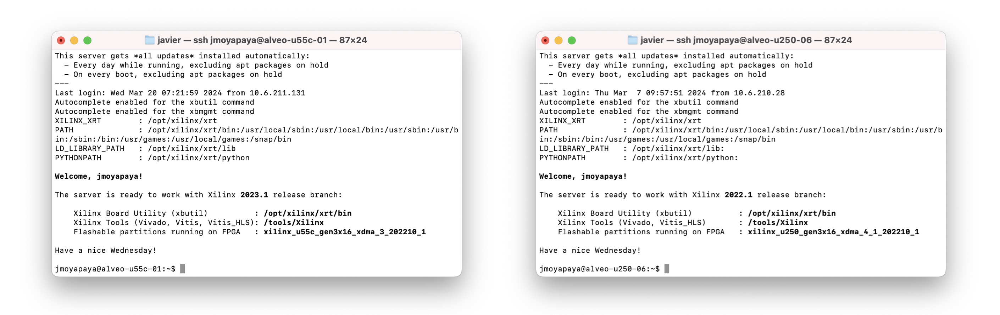

<!-- <div id="readme" class="Box-body readme blob js-code-block-container">
<article class="markdown-body entry-content p-3 p-md-6" itemprop="text"> -->
<p align="right">
<a href="https://github.com/fpgasystems">fpgasystems</a> <a href="https://github.com/fpgasystems/hacc-platform">HACC Platform</a> <a href="https://github.com/fpgasystems/sgrt">SGRT</a>
</p>

<p align="center">

</p>

<h1 align="center">
  Heterogenous Accelerated Compute Cluster
</h1>

<!-- <table align="center"> 
<tr align="center">
<td align="center" width="9999">


<h1>
  Heterogenous Accelerated Compute Cluster
</h1>
<a href="https://systems.ethz.ch">Institute for Computing Platforms - Systems Group</a>
</td>
</tr>
</table> -->

<!-- Under the scope of the [AMD Xilinx University Program](https://www.xilinx.com/support/university/XUP-HACC.html), the Heterogeneous Accelerated Compute Clusters (HACCs) is a unique initiative to support novel research in adaptive compute acceleration for high-performance computing (HPC). The scope of the program is broad and encompasses systems, architecture, tools, and applications. HACCs are equipped with the latest Xilinx technology for adaptive compute acceleration. -->

Under the scope of the <a href="https://www.xilinx.com/support/university/XUP-HACC.html">AMD University Program,</a> the <a href="https://www.amd-haccs.io">Heterogeneous Accelerated Compute Clusters (HACCs)</a> is a special initiative to support novel research in adaptive compute acceleration for high-performance computing (HPC). The scope of the program is broad and encompasses systems, architecture, tools, and applications. 

HACCs are equipped with the latest Xilinx hardware and software technologies for adaptive compute acceleration research. Each cluster is specially configured to enable some of the world’s foremost academic teams to conduct state-of-the-art HPC research. 

Five HACCs have been established at some of world’s most prestigious universities. The first of them was assigned to [Prof. Dr. Gustavo Alonso](https://people.inf.ethz.ch/alonso/) of the [Institute for Platform Computing - Systems Group (SG)](https://systems.ethz.ch) at the [Swiss Federal Institute of Technology Zurich (ETH Zürich)](https://ethz.ch/en.html) in 2020.

## Sections
* [Account renewal](/docs/account-renewal.md#account-renewal)
* [Acknowledgment and citation](#acknowledgment-and-citation)
* [Booking system](/docs/booking-system.md#booking-system)
* [Features](docs/features.md#features)
* [First steps](docs/first-steps.md#first-steps)
* [Get started](https://www.amd-haccs.io/get-started.html)
* [Hardware ACCeleration Platform (HACC Platform)](https://github.com/fpgasystems/hacc-platform)
* [Infrastructure](docs/infrastructure.md#infrastructure)
* [Known limitations](docs/known-limitations.md#known-limitations)
* [License](#license)
* [Operating the cluster](docs/operating-the-cluster.md#operating-the-cluster)
* [Playbooks 🔒](https://3.basecamp.com/5241674/buckets/25107010/documents/6507506374)
* [Releases](#releases)
* [Systems Group RunTime (SGRT)](https://github.com/fpgasystems/sgrt)
* [Technical support](docs/technical-support.md)
* [Usage guidance](#usage-guidance)
* [Vocabulary](docs/vocabulary.md#vocabulary)
* [Who does what](docs/who-does-what.md#who-does-what)

# Releases

<!-- ## Ubuntu
Regarding the operating system, Ubuntu versioning is according to [IT Services Group (ISG) D-INFK](https://www.isg.inf.ethz.ch/Main/) release schedule:

<table class="tg">
<thead>
  <tr style="text-align:center">
    <th class="tg-0pky" rowspan="2"><div align="center">Cluster</div></th>
    <th class="tg-0pky" colspan="2" style="text-align:center"><div align="center">Release</div></th>
    <th class="tg-c3ow" rowspan="2">Kernel</th>
  </tr>
  <tr>
    <th class="tg-0pky" style="text-align:center">20.04</th>
    <th class="tg-0pky" style="text-align:center">22.04</th>
  </tr>
</thead>
<tbody>
  <tr>
    <td class="tg-0pky"><div align="center">BUILD</div></td>
    <td class="tg-0pky" align="center">&#9675;</td>
    <td class="tg-0pky" align="center">&#9679;</td>
    <td class="tg-0pky" align="center">5.4.0-164-generic</td>
  </tr>
  <tr>
    <td class="tg-0pky"><div align="center">U250</div></td>
    <td class="tg-0pky" align="center">&#9675;</td>
    <td class="tg-0pky" align="center">&#9679;</td>
    <td class="tg-0pky" align="center">5.4.0-164-generic<br></td>
  </tr>
  <tr>
    <td class="tg-0pky"><div align="center">U280</div></td>
    <td class="tg-0pky" align="center">&#9675;</td>
    <td class="tg-0pky" align="center">&#9679;</td>
    <td class="tg-0pky" align="center">5.4.0-164-generic</td>
  </tr>
  <tr>
    <td class="tg-0pky"><div align="center">U50D</div></td>
    <td class="tg-0pky" align="center">&#9675;</td>
    <td class="tg-0pky" align="center">&#9679;</td>
    <td class="tg-0pky" align="center">5.4.0-164-generic</td>
  </tr>
  <tr>
    <td class="tg-0pky"><div align="center">U55C</div></td>
    <td class="tg-0pky" align="center">&#9675;</td>
    <td class="tg-0pky" align="center">&#9679;</td>
    <td class="tg-0pky" align="center">5.4.0-164-generic</td>
  </tr>
  <tr>
    <td class="tg-0pky"><div align="center">Versal</div></td>
    <td class="tg-0pky" align="center">&#9675;</td>
    <td class="tg-0pky" align="center">&#9679;</td>
    <td class="tg-0pky" align="center">5.4.0-164-generic</td>
  </tr>
  <tr>
    <td class="tg-0pky"><div align="center">HACC BOXES</div></td>
    <td class="tg-0pky" align="center">&#9675;</td>
    <td class="tg-0pky" align="center">&#9679;</td>
    <td class="tg-0pky" align="center">5.4.0-164-generic</td>
  </tr>
</tbody>
<tfoot><tr><td colspan="5">&#9675; Existing release.</td></tr></tfoot>
<tfoot><tr><td colspan="5">&#9679; Existing release installed on the cluster.</td></tr></tfoot>
</table> -->

## Xilinx Tools
Xilinx's tool versioning for ACAP and FPGAs follows [XRT’s release schedule.](https://github.com/Xilinx/XRT/releases) All servers equipped with Alveo or Versal boards (referred to as deployment servers) are associated with a unique Xilinx software version. This includes XRT's Xilinx Board Utility (xbutil), Vivado, Vitis_HLS, and the flashable partitions (or base shell) running on the reconfigurable devices.

<table class="tg">
<thead>
  <tr style="text-align:center">
    <th class="tg-0pky" rowspan="2"><div align="center">Cluster</div></th>
    <th class="tg-0pky" colspan="3" style="text-align:center"><div align="center">Release</div></th>
    <th class="tg-c3ow" rowspan="2">Base shell</th>
  </tr>
  <tr>
    <th class="tg-0pky" style="text-align:center">2021.2</th>
    <th class="tg-0pky" style="text-align:center">2022.1</th>
    <th class="tg-0pky" style="text-align:center">2022.2</th>
  </tr>
</thead>
<tbody>
  <tr>
    <td class="tg-0pky"><div align="center">BUILD</div></td>
    <td class="tg-0pky" align="center">&#9679;</td>
    <td class="tg-0pky" align="center">&#9679;</td>
    <td class="tg-0pky" align="center">&#9679;</td>
    <td class="tg-0pky" style="text-align:center"> </td>
  </tr>
  <tr>
    <td class="tg-0pky"><div align="center">U250</div></td>
    <td class="tg-0pky" align="center">&#9679;</td>
    <td class="tg-0pky" align="center">&#9679;</td>
    <td class="tg-0pky" align="center"> </td>
    <td class="tg-0pky">xilinx_u250_gen3x16_base_4<br>xilinx_u250_gen3x16_xdma_shell_4_1<br></td>
  </tr>
  <tr>
    <td class="tg-0pky"><div align="center">U280</div></td>
    <td class="tg-0pky" align="center">&#9675;</td>
    <td class="tg-0pky" align="center">&#9679;</td>
    <td class="tg-0pky" align="center"> </td>
    <td class="tg-0pky">xilinx_u280_gen3x16_xdma_base_1</td>
  </tr>
  <tr>
    <td class="tg-0pky"><div align="center">U50D</div></td>
    <td class="tg-0pky" align="center">&#9675;</td>
    <td class="tg-0pky" align="center">&#9679;</td>
    <td class="tg-0pky" align="center">&#9675;</td>
    <td class="tg-0pky" style="text-align:center">xilinx_u50_gen3x16_xdma_base_5</td>
  </tr>
  <tr>
    <td class="tg-0pky"><div align="center">U55C</div></td>
    <td class="tg-0pky" align="center">&#9675;</td>
    <td class="tg-0pky" align="center">&#9679;</td>
    <td class="tg-0pky" align="center">&#9675;</td>
    <td class="tg-0pky">xilinx_u55c_gen3x16_xdma_base_3</td>
  </tr>
  <tr>
    <td class="tg-0pky"><div align="center">Versal</div></td>
    <td class="tg-0pky" align="center">&#9675;</td>
    <td class="tg-0pky" align="center">&#9675;</td>
    <td class="tg-0pky" align="center">&#9679;</td>
    <td class="tg-0pky">xilinx_vck5000_gen4x8_qdma_base_2</td>
  </tr>
  <tr>
    <td class="tg-0pky"><div align="center">HACC BOXES</div></td>
    <td class="tg-0pky" align="center">&#9675;</td>
    <td class="tg-0pky" align="center">&#9675;</td>
    <td class="tg-0pky" align="center">&#9679;</td>
    <td class="tg-0pky">xilinx_u55c_gen3x16_xdma_base_3<br>xilinx_vck5000_gen4x8_qdma_base_2</td>
  </tr>
</tbody>
<tfoot><tr><td colspan="5">&#9675; Existing release.</td></tr></tfoot>
<tfoot><tr><td colspan="5">&#9679; Existing release installed on the cluster.</td></tr></tfoot>
</table>

Some deployment servers also feature Vitis installed. Pay attention to the **welcome message,** as it will indicate the installed tools and their locations.


*Installed Xilinx Tools.*

<!-- ### Vitis AI

<table class="tg">
<thead>
  <tr style="text-align:center">
    <th class="tg-0pky" rowspan="3"><div align="center">Cluster</div></th>
    <th class="tg-0pky" colspan="3" style="text-align:center"><div align="center">Release</div></th>
  </tr>
  <tr>
    <th class="tg-0pky" style="text-align:center">2022.1</th>
    <th class="tg-0pky" style="text-align:center">2022.2</th>
    <th class="tg-0pky" style="text-align:center">2023.1</th>
  </tr>
</thead>
<tbody>
  <tr>
    <td class="tg-0pky"><div align="center">BUILD</div></td>
    <td class="tg-0pky" align="center"> </td>
    <td class="tg-0pky" align="center"> </td>
    <td class="tg-0pky" align="center"> </td>
  </tr>
  <tr>
    <td class="tg-0pky"><div align="center">U250</div></td>
    <td class="tg-0pky" align="center"> </td>
    <td class="tg-0pky" align="center">&#9679;</td>
    <td class="tg-0pky" align="center">&#9679;</td>
  </tr>
  <tr>
    <td class="tg-0pky"><div align="center">U280</div></td>
    <td class="tg-0pky" align="center"> </td>
    <td class="tg-0pky" align="center">&#9679;</td>
    <td class="tg-0pky" align="center">&#9679;</td>
    
  </tr>
  <tr>
    <td class="tg-0pky"><div align="center">U50D</div></td>
    <td class="tg-0pky" align="center"> </td>
    <td class="tg-0pky" align="center">&#9679;</td>
    <td class="tg-0pky" align="center">&#9679;</td>
  </tr>
  <tr>
    <td class="tg-0pky"><div align="center">U55C</div></td>
    <td class="tg-0pky" align="center"> </td>
    <td class="tg-0pky" align="center">&#9679;</td>
    <td class="tg-0pky" align="center"> </td>
  </tr>
  <tr>
    <td class="tg-0pky"><div align="center">Versal</div></td>
    <td class="tg-0pky" align="center"> </td>
    <td class="tg-0pky" align="center">&#9679;</td>
    <td class="tg-0pky" align="center">&#9679;</td>
  </tr>
  <tr>
    <td class="tg-0pky"><div align="center">HACC BOXES</div></td>
    <td class="tg-0pky" align="center"> </td>
    <td class="tg-0pky" align="center">&#9679;</td>
    <td class="tg-0pky" align="center">&#9679;</td>
  </tr>
</tbody>
<tfoot><tr><td colspan="5">&#9675; Existing release.</td></tr></tfoot>
<tfoot><tr><td colspan="5">&#9679; Existing release installed on the cluster.</td></tr></tfoot>
</table> -->

## HIP and ROCm Tools
For GPU accelerators, HIP and ROCm tools versioning is according to [HIP release schedule](https://github.com/ROCm-Developer-Tools/HIP/releases):

<table class="tg">
<thead>
  <tr style="text-align:center">
    <th class="tg-0pky" rowspan="2"><div align="center">Cluster</div></th>
    <th class="tg-0pky" colspan="3" style="text-align:center"><div align="center">HIP Release</div></th>
    <th class="tg-c3ow" rowspan="2">ROCm Release</th>
  </tr>
  <tr>
    <th class="tg-0pky" style="text-align:center">5.4.1</th>
    <th class="tg-0pky" style="text-align:center">5.4.3</th>
    <th class="tg-0pky" style="text-align:center">5.7.1</th>
  </tr>
</thead>
<tbody>
  <tr>
    <td class="tg-0pky"><div align="center">HACC BOXES</div></td>
    <td class="tg-0pky" align="center"></td>
    <td class="tg-0pky" align="center"></td>
    <td class="tg-0pky" align="center">&#9679;</td>
    <td class="tg-0pky" align="center">Version 1.1</td>
  </tr>
</tbody>
<tfoot><tr><td colspan="5">&#9675; Existing release.</td></tr></tfoot>
<tfoot><tr><td colspan="5">&#9679; Existing release installed on the cluster.</td></tr></tfoot>
</table>

# Usage guidance
When utilizing the HACC, please adhere to the following guidelines:

* **Deployment servers:** Utilize deployment servers exclusively for testing and verification purposes. Refrain from utilizing them for any software builds. Restrict your usage on these machines to Vitis and HIP runtime.

* **Software builds:** For software building tasks, utilize the HACC BUILD cluster instead. This machine allows multiple users simultaneous access without requiring booking. Only resort to this node if you lack local access to suitable servers for running builds in your institute.

* **Tool installations:** Users are only permitted to use preinstalled tools on the system. Avoid installing external tools without prior approval from the HACC manager. If utilizing PYNQ, you may install packages using pip3, ensuring the package is system-wide installed beforehand. For any special requirements, contact [research_clusters@amd.com,](mailto:research_clusters@amd.com) and we will endeavor to accommodate your needs.

* Lastly, ensure compliance with the [Booking rules.](./docs/booking-system.md#booking-rules)

# Acknowledgment and citation

We encourage ETHZ-HACC users to acknowledge the support provided by AMD and ETH Zürich for their research in presentations, papers, posters, and press releases. Please use the following acknowledgment statement and citation.

## Acknowledgment

This work was supported in part by AMD under the Heterogeneous Accelerated Compute Clusters (HACC) program (formerly known as the XACC program - Xilinx Adaptive Compute Cluster program)

## Citation

[](https://doi.org/10.5281/zenodo.8340448)

```
@misc{moya2023hacc,
  author       = {Javier Moya, Matthias Gabathuler, Mario Ruiz, Gustavo Alonso},
  title        = {fpgasystems/hacc: ETHZ-HACC 2022.1},
  howpublished = {Zenodo},
  year         = {2023},
  month        = sep,
  note         = {\url{https://doi.org/10.5281/zenodo.8344513}},
  doi          = {10.5281/zenodo.8340448}
}
```

### Download

To get a printed copy of the cited resource, please follow [this link.](https://public.3.basecamp.com/p/oQPqiHQ8yHNatsMT7zMxteZ5) 

# License

[](https://opensource.org/licenses/MIT)

Copyright (c) 2022 FPGA @ Systems Group, ETH Zurich

Permission is hereby granted, free of charge, to any person obtaining a copy
of this software and associated documentation files (the "Software"), to deal
in the Software without restriction, including without limitation the rights
to use, copy, modify, merge, publish, distribute, sublicense, and/or sell
copies of the Software, and to permit persons to whom the Software is
furnished to do so, subject to the following conditions:

The above copyright notice and this permission notice shall be included in all
copies or substantial portions of the Software.

THE SOFTWARE IS PROVIDED "AS IS", WITHOUT WARRANTY OF ANY KIND, EXPRESS OR
IMPLIED, INCLUDING BUT NOT LIMITED TO THE WARRANTIES OF MERCHANTABILITY,
FITNESS FOR A PARTICULAR PURPOSE AND NONINFRINGEMENT. IN NO EVENT SHALL THE
AUTHORS OR COPYRIGHT HOLDERS BE LIABLE FOR ANY CLAIM, DAMAGES OR OTHER
LIABILITY, WHETHER IN AN ACTION OF CONTRACT, TORT OR OTHERWISE, ARISING FROM,
OUT OF OR IN CONNECTION WITH THE SOFTWARE OR THE USE OR OTHER DEALINGS IN THE
SOFTWARE.