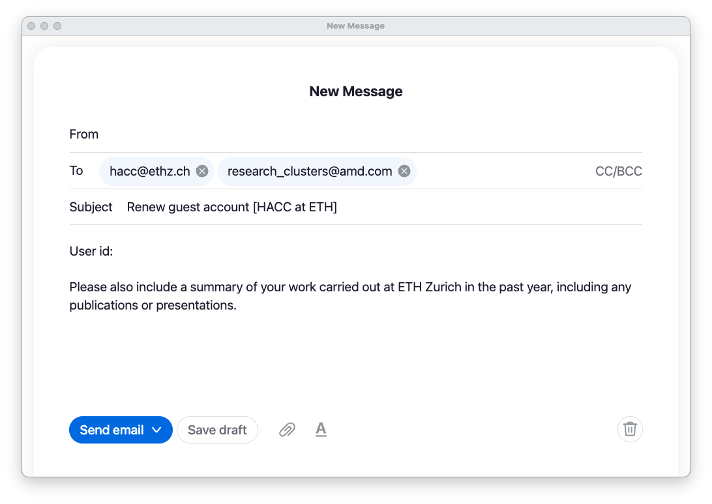

<article class="markdown-body entry-content p-3 p-md-6" itemprop="text">

<a href="https://github.com/fpgasystems/hacc#--heterogenous-accelerated-compute-cluster">Back to top</a>

# Account renewal

The guest account expires after one year. A month before the deadline, you will receive an email reminder. If you plan to keep using the ETHZ-HACC, please write back to [hacc@ethz.ch](mailto:hacc@ethz.ch) an email like the one in the picture below:

*Account renewal.*

Once the account expires, all user data is automatically deleted from its home directory and the account cannot be restored.