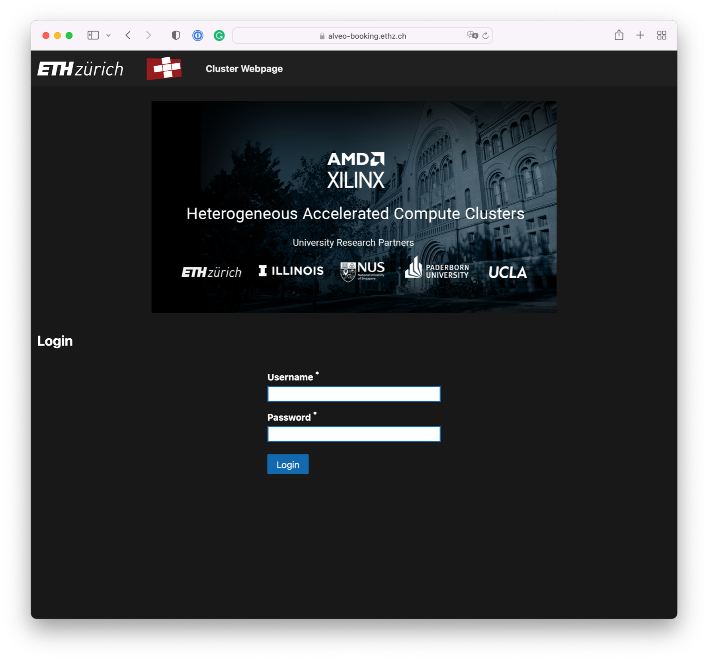

<article class="markdown-body entry-content p-3 p-md-6" itemprop="text">

<a href="https://github.com/fpgasystems/hacc/blob/main/README.md#sections">Back</a>

# Booking system 
Before connecting to any HACC servers, you must make a reservation through the [booking system](https://alveo-booking.ethz.ch/login.php). To use the booking system, please remember the following:

* You must be connected to the ETH network in order to access it, and
* Use your **main LDAP/Active directory password** as a part of your credentials.

*Booking system.*

## Booking rules
The HACCs are a collaborative hub; many people may want access to the same limited resources. The following simple rules should help:

1. We kindly ask users to limit the bookings to the shortest period. 
2. Release the booking as soon as possible if you finish early; other users may be waiting.
3. The default maximum booking time is 5 hours. 
4. Note that you can book resources for the future if you need the hardware at a particular time.
5. Don’t assume there will be limited demand for a HACC during the night: other users in different time zones may want to access the HACC.
6. Do not systematically extend your booking times: if you predict that your experiments will require longer, submit a request to research_clusters@amd.com outlining your needs so we can arrange a plan.