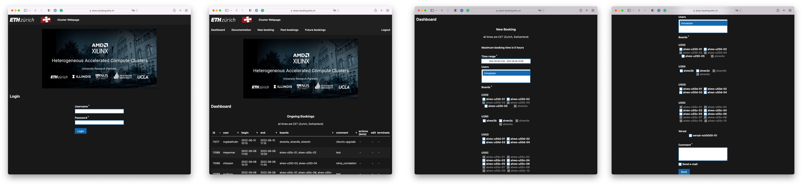
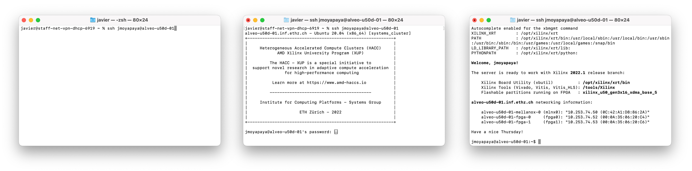
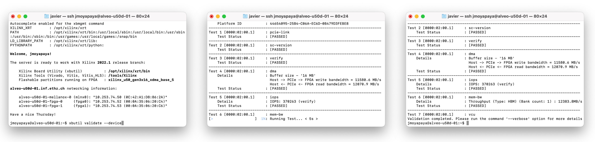
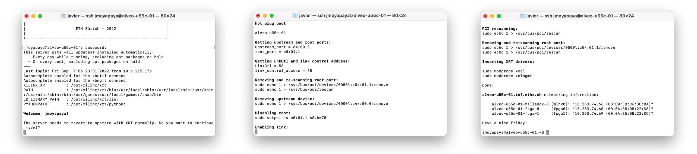
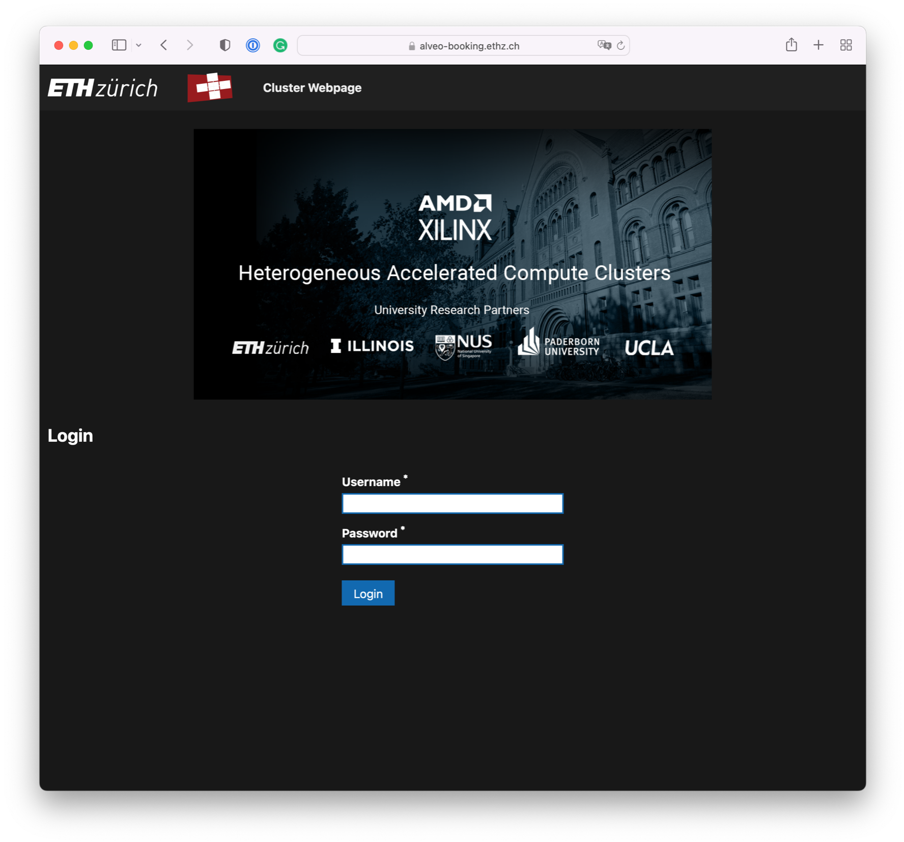

# Usage guidance
When utilizing the HACC, please adhere to the following guidelines:

* **Deployment servers:** Utilize deployment servers exclusively for testing and verification purposes. Refrain from utilizing them for any software builds. Restrict your usage on these machines to Vitis and HIP runtime.

* **Software builds:** For software building tasks, utilize the HACC BUILD cluster instead. This machine allows multiple users simultaneous access without requiring booking. Only resort to this node if you lack local access to suitable servers for running builds in your institute.

* **Tool installations:** Users are only permitted to use preinstalled tools on the system. Avoid installing external tools without prior approval from the HACC manager. If utilizing PYNQ, you may install packages using pip3, ensuring the package is system-wide installed beforehand. For any special requirements, contact [research_clusters@amd.com,](mailto:research_clusters@amd.com) and we will endeavor to accommodate your needs.

* Lastly, ensure compliance with the [Booking rules.](./docs/booking-system.md#booking-rules)

## Booking and accessing a server
After configuring our passwords and virtual private network connection, the next step would be to reserve a server through the [booking system](https://alveo-booking.ethz.ch/login.php) and then access it. **Please remember that you must be connected to the ETH network to make use of the booking system.**

### Booking a server
Please, follow these steps to book a server:

1. Log in into the [booking system](https://alveo-booking.ethz.ch/login.php) using your **main LDAP/Active directory password**,
2. Once you are on the *Dashoboard* page, please click on *New booking*,
3. Select the *Time range,* the *Boards* or servers you wish to book, along with a mandatory *Comment* referring to your research activites, and
4. Press the *Book* button.

We would like you to follow the [booking rules](../docs/booking-system.md#booking-rules) while you work with the cluster.

*Booking a server.*

### Accessing a server
After [booking a server](#booking-a-server)—and assuming you are connected to ETH network via VPN— you should be able to access it using ssh, i.e.: `ssh jmoyapaya@alveo-u50d-05`. Please remember that for accessing a server you should also use your **main LDAP/Active directory password**:

*Accessing a server.*

You can also make use of **X11 forwarding** if you need to run graphical applications on the remote server (for instance, Vivado). For this, please add a -X after the ssh command, i.e.: `ssh -X jmoyapaya@alveo-u50d-05`.

## Validating a Xilinx accelerator card
Once you are logged into a server, you should be able to validate server’s accelerator card with `xbutil validate --device`:

*Validating a Xilinx accelerator card.*

### Reverting to Vitis workflow
It is possible that when you log on to a server, you may find that the previous user has left the server in *Vivado mode.* In such a situation, you have the opportunity to revert the server to work again with the Vitis workflow by following the instructions on the screen:

*Reverting to Vitis workflow is based on the [hot-plug boot](https://github.com/fpgasystems/hacc/blob/main/docs/vocabulary.md#pci-hot-plug) process.*

## References
* [1] [Remote Access by Secure Shell (SSH) using a jump host](https://www.isg.inf.ethz.ch/Main/HelpRemoteAccessSSH)

# Booking system
Before connecting to any HACC servers, you must make a reservation through the [booking system](https://hacc-booking.ethz.ch/login.php). To use the booking system, please remember the following:

* You must be connected to the ETH network in order to access it, and
* Use your **main LDAP/Active directory password** as a part of your credentials.

**Please notice that you do not need to book the build servers.**

*Booking system.*

## Booking rules
The HACCs are a collaborative hub; many people may want access to the same limited resources. The following simple rules should help:

1. We kindly ask users to limit the bookings to the shortest period. 
2. Release the booking as soon as possible if you finish early; other users may be waiting.
3. The default maximum booking time is 5 hours. 
4. Note that you can book resources for the future if you need the hardware at a particular time.
5. Don’t assume there will be limited demand for a HACC during the night: other users in different time zones may want to access the HACC.
6. Do not systematically extend your booking times: if you predict that your experiments will require longer, submit a request to research_clusters@amd.com outlining your needs so we can arrange a plan.
