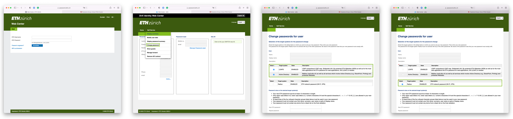
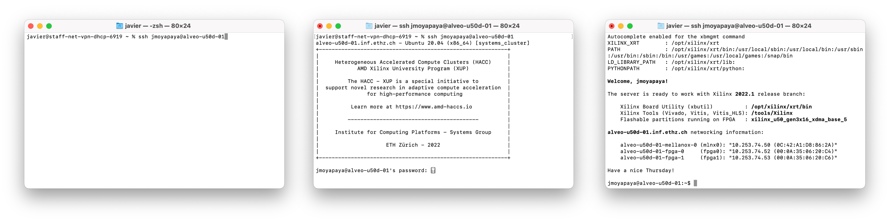
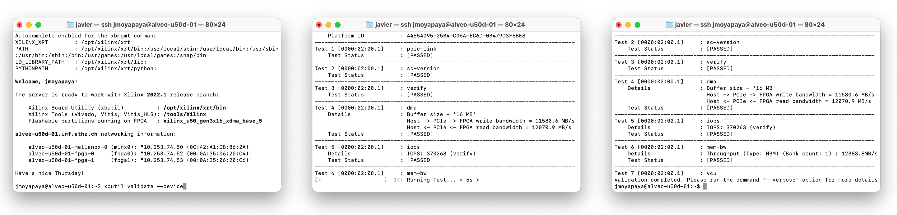
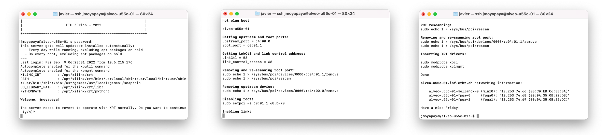

<div id="readme" class="Box-body readme blob js-code-block-container">
<article class="markdown-body entry-content p-3 p-md-6" itemprop="text">
<p align="right">
<a href="https://github.com/fpgasystems/hacc#--heterogenous-accelerated-compute-cluster">Back to top</a>
</p>

# First steps
This guide will help you set up your HACC account, booking and accessing a server, and validate server’s Xilinx accelerator card. We will cover the following sections:

* [Setting your passwords](#setting-your-passwords)
* [Setting your secure remote access](#setting-your-remote-secure-access)
* [Booking and accessing a server](#booking-and-accessing-a-server)
* [Validating a Xilinx accelerator card](#validating-a-xilinx-accelerator-card) 

Before continuing, please make sure you have been already accepted on ETH Zürich HACC program and you have a valid user account. In any other case, please visit [Get started](https://www.amd-haccs.io/get-started.html).

## Setting your passwords
Once your ETH account has been created, you will need to generate two different passwords: an LDAP/Active directory password and a RADIUS password. The first one is part of your main ETH credentials; the *remote authentication dial-in user service (RADIUS)* password is used for [setting your remote secure access](#setting-your-remote-secure-access). Please, follow these steps to generate them:

1. Visit the ETH Zürich [Web Center,](https://iam.password.ethz.ch/authentication/login_en.html)
2. Click on *Forgot your password* to receive a temporal password to use with Web Center,
3. Log in to Web Center and click on *Self service/Change password*,
4. Select the *LDAPS* and *Active Directory* checkboxes and introduce your new password, and
5. Select the *Radius* checkbox and introduce your new password.


*Setting your passwords.*

## Setting your remote secure access
You must be connected to the ETH network to access the cluster. If this is not the case, you first need to establish a secure remote connection—either through a [jump host](#jump-host) [[1]](#references) or a [virtual private network (VPN)](#virtual-private-network-vpn)—before being able to use the HACC servers.

### Jump host
To make use of ETH’s jumphost, first you would need to edit your ```~/.ssh/config``` file by adding the following lines:

```
# Remote Access by Secure Shell (SSH) - ETHZ

ServerAliveInterval 300
ServerAliveCountMax 12

Host jumphost.inf.ethz.ch
    User ETHUSER

Host *.ethz.ch !jumphost.inf.ethz.ch
    User ETHUSER
    ProxyJump jumphost.inf.ethz.ch
```

After that, you should be able to access HACC servers with SSH, for instance: ```ssh ETHUSER@alveo-build-01.ethz.ch```. **Please note that for the proposed ssh-configuration file, you must include** ```.ethz.ch``` **when you try to log in to the server.**

### Virtual private network (VPN)
To create your virtual private network connection, please use the following on your favourite VPN client: 

* ETH employees and guest accounts:
    * Server address: ```sslvpn.ethz.ch```
    * Account name: ```ETHUSER@staff-net.ethz.ch```
    * Password: ```RADIUS password```
    * Shared secret: *According to received information*
    * Group name: ```staff-net```

* ETH students:
    * Server address: ```sslvpn.ethz.ch```
    * Account name: ```ETHUSER@student-net.ethz.ch```
    * Password: ```RADIUS password```
    * Shared secret: *According to received information*
    * Group name: ```student-net```

## Booking and accessing a server
After configuring our passwords and virtual private network connection, the next step would be to reserve a server through the [booking system](https://alveo-booking.ethz.ch/login.php) and then access it. **Please remember that you must be connected to the ETH network to make use of the booking system.**

### Booking a server
Please, follow these steps to book a server:

1. Log in into the [booking system](https://alveo-booking.ethz.ch/login.php) using your **main LDAP/Active directory password**,
2. Once you are on the *Dashoboard* page, please click on *New booking*,
3. Select the *Time range,* the *Boards* or servers you wish to book, along with a mandatory *Comment* referring to your research activites, and
4. Press the *Book* button.

We would like you to follow the [booking rules](../docs/booking-system.md#booking-rules) while you work with the cluster.


*Booking a server.*

### Accessing a server
After [booking a server](#booking-a-server)—and assuming you are connected to ETH network via VPN— you should be able to access it using ssh, i.e.: ```ssh jmoyapaya@alveo-u50d-05```. Please remember that for accessing a server you should also use your **main LDAP/Active directory password**:


*Accessing a server.*

You can also make use of **X11 forwarding** if you need to run graphical applications on the remote server (for instance, Vivado). For this, please add a -X after the ssh command, i.e.: ```ssh -X jmoyapaya@alveo-u50d-05```.

## Validating a Xilinx accelerator card
Once you are logged into a server, you should be able to validate server’s accelerator card with ```xbutil validate --device```:


*Validating a Xilinx accelerator card.*

### Reverting to Vitis workflow
It is possible that when you log on to a server, you may find that the previous user has left the server in *Vivado mode.* In such a situation, you have the opportunity to revert the server to work again with the Vitis workflow by following the instructions on the screen:


*Reverting to Vitis workflow is based on the [hot-plug boot](https://github.com/fpgasystems/hacc/blob/main/docs/vocabulary.md#pci-hot-plug) process.*

You are ready to go! **After validating the Xilinx accelerator card, we recommend you to check out the [Examples](../examples/README.md#examples) section.**

## References
* [1] [Remote Access by Secure Shell (SSH) using a jump host](https://www.isg.inf.ethz.ch/Main/HelpRemoteAccessSSH)