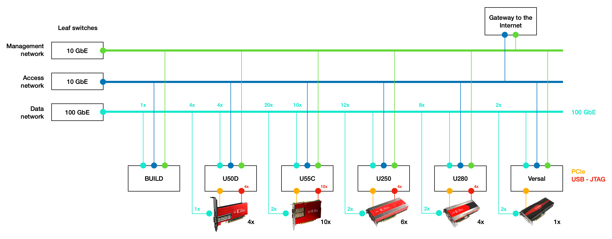

<article class="markdown-body entry-content p-3 p-md-6" itemprop="text">

<a href="https://github.com/fpgasystems/hacc/blob/main/README.md#sections">Back</a>

# Infrastructure
FSG HACC is comprised of AMD high-​end servers, Xilinx accelerator cards, and high-​speed networking. Each accelerator card has two connections to a 100 GbE TOR switch to allow exploration of arbitrary network topologies for distributed computing.

*FSG HACC is comprised of AMD high-​end servers, Xilinx accelerator cards, and high-​speed networking.*

## High-end servers
Bla bla

## Xilinx accelerator cards
Bla bla

## Networking

## Summary

         Servers    Number of FPGAs    DPS DPSs   DRAM    HBM    Notes

U55C       EPYC           10           xx xx        x      8GB    
U250       Intel          10           xx xx        x      -    -alveo-u250-05 and alveo-u250-06 are not accessible via JTAG