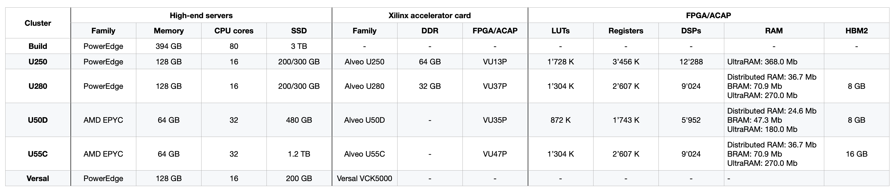

<div id="readme" class="Box-body readme blob js-code-block-container">
<article class="markdown-body entry-content p-3 p-md-6" itemprop="text">
<p align="right">
<a href="https://github.com/fpgasystems/hacc">Back to top</a>
</p>

# Infrastructure
ETHZ-HACC comprises high-end servers, Xilinx accelerator cards, and high-speed networking. Each accelerator card has all of its Ethernet interfaces connected to a 100 GbE leaf switch to allow exploration of arbitrary network topologies for distributed computing. Additionally, we are offering a build server with development and bitstream compilation purposes. <!-- Our HACC is provisioned and managed based on [Infrastructure as Code](../docs/vocabulary.md#infrastructure-as-code) using [Ansible](../docs/vocabulary.md#ansible). -->


*ETHZ-HACC is comprised of high-​end servers, Xilinx accelerator cards, and high-​speed networking.*

We are offering twenty-four Alveo data center accelerator cards and one Versal card. Remember that each high-end server exposes **only one Xilinx accelerator card to the user.** The following tables give an overview of ETHZ-HACC **server names** and their **resources:**

<!-- | Cluster | # instances | Booking | Names              | Examples                            |
|---------|-------------|---------|--------------------|-------------------------------------|
| Build   | 1           | No      | alveo-build-01     | ssh USERNAME@alveo-build-01.ethz.ch |
| U250    | 6           | Yes     | alveo-u250-[01:06] | ssh USERNAME@alveo-u250-01.ethz.ch  |
| U280    | 4           | Yes     | alveo-u280-[01:04] | ssh USERNAME@alveo-u280-01.ethz.ch  |
| U50D    | 4           | Yes     | alveo-u50d-[01:04] | ssh USERNAME@alveo-u50d-01.ethz.ch  |
| U55C    | 10          | Yes     | alveo-u55c-[01:10] | ssh USERNAME@alveo-u55c-01.ethz.ch  |
| Versal  | 1           | Yes     | versal-vck5000-01  | ssh USERNAME@versal-vck5000.ethz.ch | -->


*ETHZ-HACC server names.*


*ETHZ-HACC resources. On the FPGA/ACAP column, VU stands for [Virtex Ultrascale+](#virtex-ultrascale).*

<!-- <table>
<thead>
  <tr>
    <th rowspan="2">Cluster</th>
    <th colspan="4">High-end servers</th>
    <th colspan="3">Xilinx accelerator card</th>
    <th colspan="5">FPGA/ACAP</th>
  </tr>
  <tr>
    <th>Family</th>
    <th>Memory</th>
    <th>CPU</th>
    <th>SSD</th>
    <th>Family</th>
    <th>DDR</th>
    <th>FPGA/ACAP</th>
    <th>LUTs</th>
    <th>Registers</th>
    <th>DSPs</th>
    <th>RAM</th>
    <th>HBM2</th>
  </tr>
</thead>
<tbody>
  <tr>
    <td>Build</td>
    <td>PowerEdge R740</td>
    <td>394 GB</td>
    <td>80</td>
    <td>3 TB</td>
    <td>-</td>
    <td>-</td>
    <td>-</td>
    <td></td>
    <td></td>
    <td></td>
    <td></td>
    <td></td>
  </tr>
  <tr>
    <td>U250</td>
    <td>PowerEdge R740</td>
    <td>128 GB</td>
    <td>16</td>
    <td>200/300 GB</td>
    <td>Alveo U250</td>
    <td>64 GB</td>
    <td>VU13P</td>
    <td>1’728 K</td>
    <td>3’456 K</td>
    <td>12’288</td>
    <td>UltraRAM: 368.0 Mb</td>
    <td>-</td>
  </tr>
  <tr>
    <td>U280</td>
    <td>PowerEdge R740</td>
    <td>128 GB</td>
    <td>16</td>
    <td>200/300 GB</td>
    <td>Alveo U280</td>
    <td>32 GB</td>
    <td>VU37P</td>
    <td>1’304 K</td>
    <td>2’607 K</td>
    <td>9’024</td>
    <td>-BRAM: 70.9 Mb<br>-UltraRAM: 270.0 Mb</td>
    <td>8 GB</td>
  </tr>
  <tr>
    <td>U50D</td>
    <td>AMD EPYC 7302</td>
    <td>64 GB</td>
    <td>32</td>
    <td>480 GB</td>
    <td>Alveo U50D</td>
    <td>-</td>
    <td>VU35P</td>
    <td>872 K</td>
    <td>1’743 K</td>
    <td>5’952</td>
    <td>-Distributed RAM: 24.6 Mb<br>-BRAM: 47.3 Mb<br>-UltraRAM: 180.0 Mb</td>
    <td>8 GB</td>
  </tr>
  <tr>
    <td>U55C</td>
    <td>AMD EPYC 7302</td>
    <td>64 GB</td>
    <td>32</td>
    <td>1.2 TB</td>
    <td>Alveo U55C</td>
    <td>-</td>
    <td>VU47P</td>
    <td>1’304 K</td>
    <td>2’607 K</td>
    <td>9’024</td>
    <td>-Distributed RAM: 36.7 Mb<br>-BRAM: 70.9 Mb<br>-UltraRAM: 270.0 Mb</td>
    <td>16 GB</td>
  </tr>
  <tr>
    <td>Versal</td>
    <td>PowerEdge R740</td>
    <td>128 GB</td>
    <td>16</td>
    <td>200 GB</td>
    <td>Versal VCK5000</td>
    <td></td>
    <td></td>
    <td></td>
    <td></td>
    <td></td>
    <td></td>
    <td></td>
  </tr>
</tbody>
</table> -->

## *Build cluster*
We are offering a *build cluster* for development and bitstream compilation purposes. Multiple users can access this machine simultaneously without booking it first. Please only use the HACC build servers if you do not have access to similar resources at your research institution: too many users running large jobs on this machine will likely cause builds to run slowly—or sometimes to fail. Also, avoid using the build servers for debugging or simulating your hardware.

## High-end servers and Xilinx accelerator cards
### AMD EPYC
EPYC is the world’s highest-performing x86 server processor with faster performance for cloud, enterprise, and HPC workloads. To learn more about it, please refer to the [AMD EPYC processors website](https://www.amd.com/en/processors/epyc-server-cpu-family) and its [data sheet.](https://www.amd.com/system/files/documents/amd-epyc-7003-series-datasheet.pdf)

<!-- ## Xilinx accelerator cards -->
### Virtex Ultrascale+
Virtex UltraScale+ devices provide the highest performance and integration capabilities in a 14nm/16nm FinFET node. It also provides registered inter-die routing lines enabling >600 MHz operation, with abundant and flexible clocking to deliver a virtual monolithic design experience. As the industry’s most capable FPGA family, the devices are ideal for compute-intensive applications ranging from 1+Tb/s networking and machine learning to radar/early-warning systems.

* [Alveo U250](https://www.xilinx.com/products/boards-and-kits/alveo/u250.html)
* [Alveo U280](https://www.xilinx.com/products/boards-and-kits/alveo/u280.html)
* [Alveo U50D](https://www.xilinx.com/products/boards-and-kits/alveo/u50.html)
* [Alveo U55C](https://www.xilinx.com/applications/data-center/high-performance-computing/u55c.html)

### Versal ACAP
Versal ACAPs deliver unparalleled application- and system-level value for cloud, network, and edge applications​. The disruptive 7nm architecture combines heterogeneous compute engines with a breadth of hardened memory and interfacing technologies for superior performance/watt over competing 10nm FPGAs.

* [Versal VCK5000](https://www.xilinx.com/products/boards-and-kits/vck5000.html)

### Storage
Each HACC users can store data on the following directories:
* ```/home/USERNAME```: directory on an NFS drive accessible by USERNAME from any the HACC servers.
* ```/mnt/scratch```: directory on an NFS drive accessible by all users from any of the HACC servers.
* ```/local/home/USERNAME/```: directory on the local server drive accessible by USERNAME on the HACC server.
* ```/tmp```: directory on the local server drive accessible by all users on the HACC server. Its content is removed every time the server is restarted.   

### USB - JTAG connectivity
The USB - JTAG connection allows granted users to interact directly with the FPGA by downloading bitstreams or updating memory content. The correct setup and access of a USB - JTAG connection is essential developers using working with [Vivado workflow](./vocabulary.md#vivado-workflow).

## Networking


*Management, access and data networks.*

### Management network
We refer to the management network as the infrastructure allowing our IT administrators to manage, deploy, update and monitor our cluster **remotely.**

### Access network
The access network is the infrastructure that allows secure remote access to our **users** through SSH.

### Data network
For our **high-speed networking** data network, we are using a [spine-leaf architecture](../docs/vocabulary.md#spine-leaf-architecture) where the L2 leaf layer is built with 100 GbE [Cisco Nexus 9336c FX2](https://www.cisco.com/c/en/us/products/switches/nexus-9336c-fx2-switch/index.html) switches and active optic cables (AOCs):


*Spine-leaf data network architecture.*

On the server side, the CPU NICs are [ConnectX-5](https://www.nvidia.com/en-us/networking/ethernet/connectx-5/) adaptors. As shown in the first figure, only one of cards interface is connected to the corresponding leaf switch (see [Known limitations](#known-limitations)), whereas both QSFP28 FPGA connectors are directly attached. For a given SERVERNAME, the following are valid IP addresses (interfaces):

* SERVERNAME-mallanox-0
* SERVERNAME-fpga-0
* SERVERNAME-fpga-1