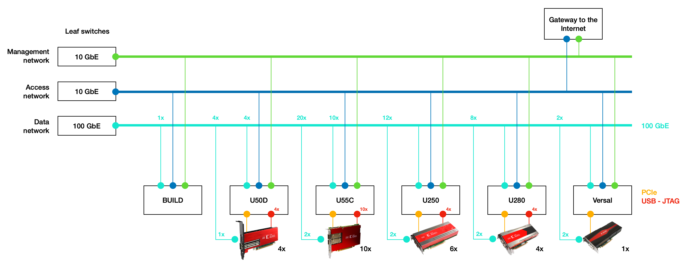
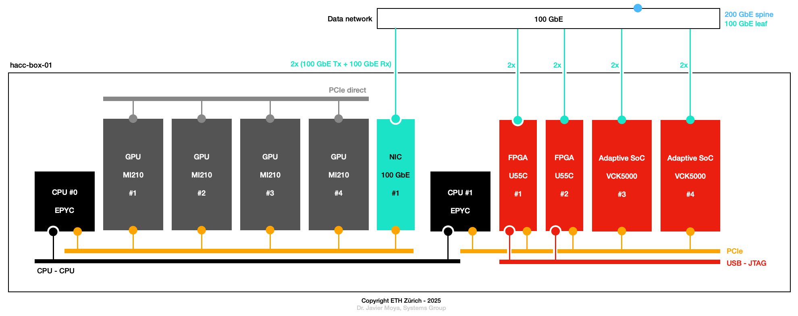
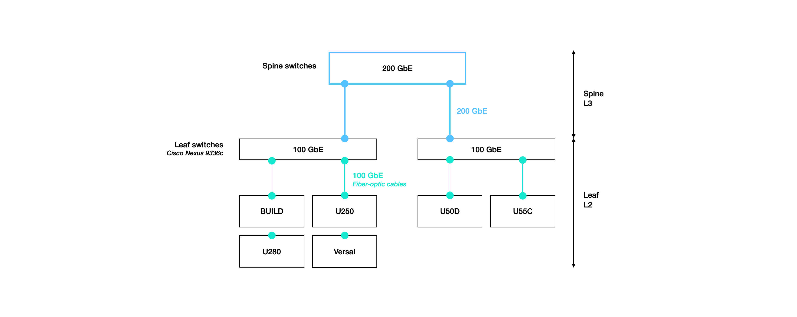

<article class="markdown-body entry-content p-3 p-md-6" itemprop="text">

<a href="https://github.com/fpgasystems/hacc#--heterogenous-accelerated-compute-cluster">Back to top</a>

# Infrastructure
The ETHZ-HACC comprises build and deployment servers. **Build servers are dedicated to development and bitstream compilation,** providing a robust environment for software and hardware design. **Deployment servers,** on the other hand, host one or more acceleration devices, enabling **high-performance execution of workloads.** This separation ensures an efficient workflow, allowing developers to compile and test their applications on build servers before deploying them to accelerator-equipped machines for execution.

*ETHZ-HACC infrastructure. This diagram is for illustrative purposes and may be subject to change. Please refer to the table below for the specific server configuration.*

## Build servers
Build servers are dedicated for development and bitstream compilation purposes. Multiple users can access this machine simultaneously **without booking it first.** Please only use the HACC build servers if you do not have access to similar resources at your research institution: too many users running large jobs on this machine will likely cause builds to run slowly—or sometimes to fail. Also, avoid using the build servers for debugging or simulating your hardware.

We maintain a broad collection of Vivado, Vitis and ROCm versions on our Build servers. Users can select their preferred version using the `module` command. See the [module section](./docs/software-tools.md#module) for more info.

<!-- ETHZ-HACC comprises high-end servers, GPUs, reconfigurable accelerator cards, and high-speed networking. Each accelerator card has all of its Ethernet interfaces connected to a 100 (or 200) GbE leaf switch to allow exploration of arbitrary network topologies for distributed computing. Additionally, we are offering a build server with development and bitstream compilation purposes. -->

## Deployment servers
<!-- Deployment servers are composed of high-end multi-core processors, one or more acceleration cards (like GPUs or reconfigurable accelerator cards), and high-speed networking. Reconfigurable accelerator cards have all of its Ethernet interfaces connected to a 100 (or 200) GbE leaf switch to allow exploration of arbitrary network topologies for distributed computing.  -->
Deployment servers feature high-end multi-core processors, one or more accelerator cards—such as GPUs or reconfigurable accelerator cards—and high-speed networking. The following table gives an overview of the devices installed on each of them:

<table class="tg">
<thead>
  <tr style="text-align:center">
    <th class="tg-0pky" rowspan="2">
Servers
</th>
    <th class="tg-0pky" colspan="4" style="text-align:center">
Ultrascale+ FPGA
</th>
    <th class="tg-0pky" colspan="2">
Versal FPGA
</th>
    <th class="tg-0pky" colspan="2" style="text-align:center">
GPU
</th>
  </tr>
  <tr>
    <th class="tg-0pky" style="text-align:center">U250</th>
    <th class="tg-0pky" style="text-align:center">U280</th>
    <th class="tg-0pky" style="text-align:center">U50D</th>
    <th class="tg-0pky" style="text-align:center">U55C</th>
    <th class="tg-0pky" style="text-align:center">VCK5000</th>
    <th class="tg-0pky" style="text-align:center">V80</th>
    <th class="tg-0pky" style="text-align:center">MI210</th>
  </tr>
</thead>
<tbody>
  <tr>
    <td class="tg-0pky" align="center">alveo-box-[01:02]</td>
    <td class="tg-0pky" align="center">&#9679;</td>
    <td class="tg-0pky" align="center">&#9679;</td>
    <td class="tg-0pky" align="center"></td>
    <td class="tg-0pky" align="center"></td>
    <td class="tg-0pky" align="center"></td>
    <td class="tg-0pky" align="center"></td>
    <td class="tg-0pky" align="center"></td>
  </tr>
  <tr>
    <td class="tg-0pky" align="center">alveo-u50d-[01:02]</td>
    <td class="tg-0pky" align="center"></td>
    <td class="tg-0pky" align="center"></td>
    <td class="tg-0pky" align="center">&#9679;</td>
    <td class="tg-0pky" align="center"></td>
    <td class="tg-0pky" align="center"></td>
    <td class="tg-0pky" align="center"></td>
    <td class="tg-0pky" align="center"></td>
  </tr>
  <tr>
    <td class="tg-0pky" align="center">alveo-u55c-[01:10]</td>
    <td class="tg-0pky" align="center"></td>
    <td class="tg-0pky" align="center"></td>
    <td class="tg-0pky" align="center"></td>
    <td class="tg-0pky" align="center">&#9679;</td>
    <td class="tg-0pky" align="center"></td>
    <td class="tg-0pky" align="center"></td>
    <td class="tg-0pky" align="center"></td>
  </tr>
  <tr>
    <td class="tg-0pky" align="center">alveo-v80-[01:02]</td>
    <td class="tg-0pky" align="center"></td>
    <td class="tg-0pky" align="center"></td>
    <td class="tg-0pky" align="center"></td>
    <td class="tg-0pky" align="center"></td>
    <td class="tg-0pky" align="center"></td>
    <td class="tg-0pky" align="center">&#9679;</td>
    <td class="tg-0pky" align="center"></td>
  </tr>
  <tr>
    <td class="tg-0pky" align="center">hacc-box-[01:03]               </td>
    <td class="tg-0pky" align="center">&nbsp;                         </td>
    <td class="tg-0pky" align="center">&nbsp;                         </td>
    <td class="tg-0pky" align="center">&nbsp;                         </td>
    <td class="tg-0pky" align="center">&#9679; &#9679;                </td>
    <td class="tg-0pky" align="center">&#9679; &#9679;                </td>
    <td class="tg-0pky" align="center">&nbsp;                         </td>
    <td class="tg-0pky" align="center">&#9679; &#9679; &#9679; &#9679;1</td>
  </tr>
  <tr>
    <td class="tg-0pky" align="center">                    hacc-box-04     hacc-box-05</td>
    <td class="tg-0pky" align="center">&nbsp;                          &nbsp;         </td>
    <td class="tg-0pky" align="center">&nbsp;                          &nbsp;         </td>
    <td class="tg-0pky" align="center">&nbsp;                          &nbsp;         </td>
    <td class="tg-0pky" align="center">&nbsp;                          &nbsp;         </td>
    <td class="tg-0pky" align="center">&nbsp;                          &nbsp;         </td>
    <td class="tg-0pky" align="center">&#9679; &#9679;                 &#9679; &#9679;</td>
    <td class="tg-0pky" align="center">&#9679; &#9679; &#9679; &#9679;2 &#9679; &#9679;2</td>
  </tr>
</tbody>
<tfoot><tr><td colspan="10">&#9679; Number of devices. 1 All 4 GPUs are connected using a 4P Infinity FabricTM Link Bridge  2 GPUs are connected in groups of 2 using a 2P Infinity FabricTM Link Bridge </td></tr></tfoot>
</table>

As shown in the table above, some servers are equipped with a single accelerator card, while others feature a heterogeneous mix of accelerators, including Adaptive SoCs, FPGAs, and GPUs. The section [HACC boxes architecture](#hacc-boxes-architecture) provides details on a representative heterogeneous configuration.

## Storage
Each HACC users can store data on the following directories:

- `/home/USERNAME`: directory on an NFS drive accessible by USERNAME from any of the HACC servers.
- `/mnt/scratch`: directory on an NFS drive accessible by all users from any of the HACC servers.
- `/local/home/USERNAME/`: directory on the local server drive accessible by USERNAME on the HACC server.
- `/tmp`: directory on the local server drive accessible by all users on the HACC server. Its content is removed every time the server is restarted.

### USB - JTAG connectivity
The USB - JTAG connection allows granted users to interact directly with the FPGA by downloading bitstreams or updating memory content. The correct setup and access of a USB - JTAG connection is essential for developers working with the [Vivado workflow.](./vocabulary.md#vivado-workflow)

### HACC boxes architecture
The following picture details the architecture of one of our heterogeneous servers (specifically, hacc-box-01), which is equipped with 2x EPYC Milan CPUs, 4x [Instinct MI210 GPUs,](https://www.amd.com/content/dam/amd/en/documents/instinct-business-docs/product-briefs/instinct-mi210-brochure.pdf) 1x 100 GbE NIC, 2x [Alveo U55C FPGAs,](https://www.xilinx.com/applications/data-center/high-performance-computing/u55c.html) and 2x [Versal VCK5000 Adaptive SoCs](https://www.xilinx.com/products/boards-and-kits/vck5000.html). **The diagram can be used as a reference for the configuration of other HACC boxes.**

*Server architecture of hacc-box-01. This diagram is for illustrative purposes and may be subject to change.*

## Networking

Each server has at least three connections: one to the **management network,** one to the **access network,** and one to the high-speed **data network.** Additionally, all Ethernet interfaces of reconfigurable accelerator cards are connected to a 100 GbE leaf switch (or 200 GbE for Alveo V80 compute accelerator cards), enabling the exploration of arbitrary network topologies for distributed computing.

*Management, access and data networks. This diagram is for illustrative purposes and may be subject to change.*

### Management network
We refer to the management network as the infrastructure allowing our IT administrators to manage, deploy, update and monitor our cluster **remotely.**

### Access network
The access network is the infrastructure that allows secure remote access to our **users** through SSH.

### Data network
For our **high-speed networking** data network, we are using a [spine-leaf architecture](../docs/vocabulary.md#spine-leaf-architecture) where the L2 leaf layer is built with 100 and 200 GbE [Cisco Nexus 9000 Series](https://www.cisco.com/c/en/us/support/switches/nexus-9000-series-switches/series.html) switches, and active optic cables (AOCs):

*Spine-leaf data network architecture. This diagram is for illustrative purposes and may be subject to change.*

<!-- On the server side, the CPU NICs are [ConnectX-5](https://www.nvidia.com/en-us/networking/ethernet/connectx-5/) adaptors. For the servers **with only one accelerator card, only one 100 GbE port is connected to the respective leaf switch.** On the other hand, **the HACC boxes have two 100 GbE ports connected to the respective leaf switch,** offering a total of 200 GbE effective bandwidth. -->
