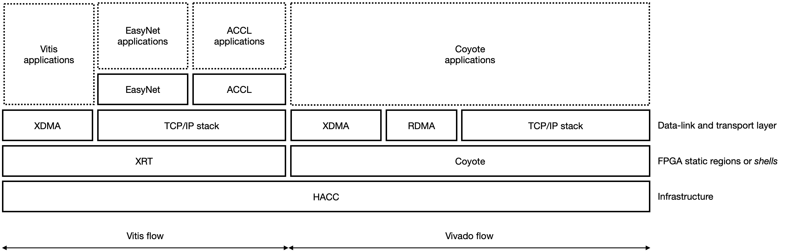

<article class="markdown-body entry-content p-3 p-md-6" itemprop="text">

<a href="https://github.com/fpgasystems/hacc/blob/main/README.md#sections">Back</a> | Next

# Projects
SG’s scientific staff uses ETHZ’s HACC to develop, test, and ship their applications. As a multi-core and FPGA cluster, the HACC allows research in distributed systems, databases, cloud computing, and hardware acceleration of data science. With Coyote, SG’s more relevant research project, we work on adapting traditional system software components (OS, databases, networking) to run on FPGAs.

*SG develops, tests, and ships its research projects using HACC infrastructure.*

## ACCL: Accelerated Collective Communication Library
ACCL enables computing kernels resident in the FPGA fabric to communicate directly under host supervision without requiring data movement between the FPGA and host. Instead, ACCL uses [Road Runner](#road-runner-a-high-performance-tcpip-network-stack) (a Vitis-compatible TCP and UDP stacks) to connect FPGAs directly over Ethernet at up to 100 GbE on Alveo cards.

[See ACCL on GitHub.](https://github.com/Xilinx/ACCL)

## CLI
SG CLI brings Systems Group’s FPGA designs to your terminal.

[See CLI on GitHub.](https://github.com/fpgasystems/hacc/blob/main/docs/CLI.md)

## Coyote
Coyote is an open source, portable, configurable *shell* for FPGAs which provides a full suite of OS abstractions, working with the host OS. Coyote supports secure spatial and temporal multiplexing of the FPGA between tenants, virtual memory, communication, and memory management inside a uniform execution environment. The overhead of Coyote is small, and the performance benefit is significant, but more importantly, it allows us to reflect on whether importing OS abstractions wholesale to FPGAs is the best way forward.

[See Coyote on GitHub.](https://github.com/fpgasystems/Coyote)

## EasyNet: 100 GbE network for HLS
EasyNet provides a set of MPI-like communication primitives for both point-to-point and collective operations (host-to-FPGA or FPGA-to-FPGA) as a High Level Synthesis (HLS) library. Such primitives are written to saturate the 100 GbE TCP/IP interface provided by [Road Runner](#road-runner-a-high-performance-tcpip-network-stack) achieve very low latency and allowing developers to write hardware kernels with the network abstracted away behind standard interfaces.

[See EasyNet on GitHub.](https://github.com/fpgasystems/Vitis_with_100Gbps_TCP-IP)

### Hardware Transaction Processing for multi-channel memory node
Transactional memory attempts to simplify concurrent programming by allowing a group of load and store instructions to execute in an atomic way. It is a concurrency control mechanism analogous to database transactions controlling access to shared memory in concurrent computing. Transactional memory systems provide high-level abstraction as an alternative to low-level thread synchronization. Building a hardware transaction processing layer for the multi-channel memory node is valuable.

[See on GitHub.](https://github.com/rbshi/dlm)

## Road Runner: a high-performance TCP/IP network stack
Road Runner provides a 100 GbE TCP/IP and UDP interfaces based on Xilinx’s open-source and out-of-the-box Vitis components. The complementary logic building Road Runner ensures that such components are integrated on the FPGA without degrading its performance. As we can see in the diagram above, Road Runner is the communication layer for the [EasyNet](#easynet-100-gbe-network-for-hls) and [ACCL](#accl-accelerated-collective-communication-library) libraries. Such libraries use high-level language primitives to saturate Vitis’s network interface achieving very low latency.

[See Road Runner on GitHub.](https://github.com/fpgasystems/Vitis_with_100Gbps_TCP-IP)