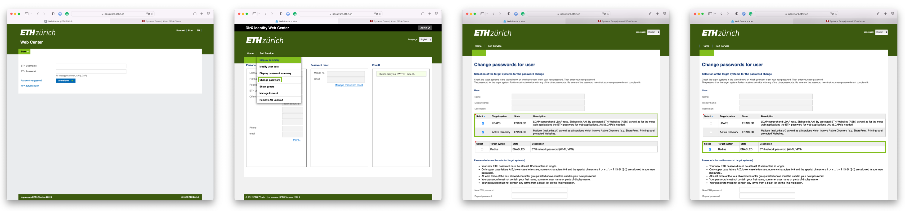

# Remote Access

## Setting your passwords
During the ETH guest account creation process, you will have been instructed to generate two different passwords: an `LDAP/Active directory` password and a `RADIUS` password.
- The `LDAP/Active directory` password is your main ETH credential.
- The `RADIUS` password is only used for accessing the VPN or the WIFI in ETH buildings.

If you haven't yet, please follow these steps to generate them:

1. Visit the ETH Zürich [Web Center](https://iam.password.ethz.ch/authentication/login_en.html)
2. Enter your ETH shortname and click 'Next'
3. Click on *Forgot password?* to receive a temporary password to use with Web Center
4. Log in to Web Center with the temporary password and click on *Self service/Change password*
5. To setup the main ETH password, select the `LDAPS` and `Active Directory` checkboxes and type your new password
6. To setup the VPN/WIFI password, select the `Radius` checkbox and type your new password
7. Setup Multi Factor Authentication (MFA) on `https://www.password.ethz.ch/qrcode/login_en.html`. Feel free to use an Authenticator app of your choice, like Microsoft Authenticator, Google Authenticator, or Ente Auth.


*Setting your passwords.*

## Accessing the ETH network
To reach the HACC servers and booking site, you need to be connected to the ETH network. If you're not physically present at ETH, you will need to setup a VPN connection or use the jumphost. Below you'll find instructions for this.

### VPN connection

The VPN is managed by the ETH Network team (ID) and Computer science departmental IT team (ISG). Feel free to have a look at their documentation here: [https://www.isg.inf.ethz.ch/Main/ServicesNetworkVPN](https://www.isg.inf.ethz.ch/Main/ServicesNetworkVPN).
#### Windows/Mac
- Download the `Cisco Secure Client` using the link provided by our network team: [https://sslvpn.ethz.ch](https://sslvpn.ethz.ch)
    - Guests are part of the `staff-net` group, so for username type `<your ETH shortname>@staff-net.ethz.ch`.
    - Be sure to use your `RADIUS` password when you login!
    - The 2nd password is the MFA OTP (One Time Password).
- Run the installer
- After setup connect to our VPN using the following credentials
    - Username: `<your eth shortname>@staff-net.ethz.ch`
    - Password: Your `RADIUS` password
    - 2nd Password: The OTP code from your MFA app

#### Linux
The `Cisco Secure Client` also has a Linux version, so you can also follow the `Windows/Mac` instructions if you like. However the recommended Linux approach is to use `openconnect`.

- Install `openconnect` with the package manager of your choice.
- Run the following command, replacing the info between \<angled brackets\> with your details.
```
sudo openconnect -u '<eth shortname>@staff-net.ethz.ch' --useragent=AnyConnect -g staff-net sslvpn.ethz.ch --no-external-auth
```
- This will prompt your for two or three passwords.
    - If you haven't used sudo in a while, Linux will first prompt you for your `sudo` password.
    - Then fill in your VPN/WIFI `RADIUS` password.
    - Finally fill in the MFA OTP.

Example:
```bash
$ sudo openconnect -u 'ethshortname@staff-net.ethz.ch' --useragent=AnyConnect -g staff-net sslvpn.ethz.ch --no-external-auth
[sudo] password for local_linux_user:                      # <==== Fill in your sudo password here, if prompted
POST https://sslvpn.ethz.ch/staff-net
Connected to XXX.XXX.XXX.XXX:443
SSL negotiation with sslvpn.ethz.ch
Connected to HTTPS on sslvpn.ethz.ch with ciphersuite (TLS1.3)-(ECDHE-SECP256R1)-(RSA-PSS-RSAE-SHA256)-(AES-128-GCM)
XML POST enabled
Server: => sslvpn.ethz.ch/VPZ_NAME
Username: ETH user name@REALM.ethz.ch
Password: ETH network password
Second Password: One Time Password (OTP)
Example:
=> Aktuell ist staff-net selektiert:
sslvpn.ethz.ch/staff-net
ETH user name@staff-net.ethz.ch
Bitte geben Sie Benutzernamen und Passwort ein.
Password:                                                  # <==== Fill in your RADIUS password here
Password:                                                  # <==== Fill in your MFA OTP code here
POST https://sslvpn.ethz.ch/staff-net
Got CONNECT response: HTTP/1.1 200 OK
CSTP connected. DPD 30, Keepalive 30
Established DTLS connection (using GnuTLS). Ciphersuite (DTLS1.2)-(ECDHE-RSA)-(AES-256-GCM).
Configured as XXX.XXX.XXX.XXX + XXXX:XXXX:XXXX:XXXX:XXXX:XXXX:XXXX/XXXX, with SSL connected and DTLS connected
Session authentication will expire at .........................
ignoring non-forwardable exclude route 0.0.0.0/32
Using vhost-net for tun acceleration, ring size 32
```
Keep this terminal window open as long as you want the VPN tunnel to be active. Stop the tunnel using `CTRL+C`.

### Jumphost
If using a VPN is not possible in your institutional network, ETH offers a [jumphost](https://www.isg.inf.ethz.ch/Main/HelpRemoteAccessSSH) as a second method to reach our network. This method is not recommended when you frequently switch between on-campus and remote.

You can add the jumphost option (`-J`) to your ssh command to use the jumphost as proxy for your ssh tunnel: `ssh -J jumphost.inf.ethz.ch <eth shortname>@hacc-build-01.inf.ethz.ch`.

You can also enter some configuration into your `~/.ssh/config` file, that will automatically proxy the traffic through the jumphost when trying to ssh to `ethz.ch` domains.

```ssh
Host jumphost.inf.ethz.ch
    User <your eth shortname>

Host hacc-*.inf.ethz.ch alveo-*.inf.ethz.ch
    User <your eth shortname>
    ProxyJump jumphost.inf.ethz.ch

Host hacc-* alveo-*
    HostName %h.inf.ethz.ch
    User <your eth shortname>
    ProxyJump jumphost.inf.ethz.ch
```

This defines that if you do `ssh jumphost.inf.ethz.ch`, it will automatically use your username to login. The second block defines that if you try to do `ssh hacc-build-01.inf.ethz.ch` for example, you will automatically use your username to login and proxy the traffic over the jumphost. The third does the same as the second, but allows you to drop the domain (`.inf.ethz.ch`) and just use `ssh hacc-build-01` for example. The ssh config file can do much more for you, and it's worth it to read `man ssh_config` to configure it to your liking. Also [this blog post](https://geertroks.com/blog/post/linux-ssh-config) gives you most of the important options.

#### Book a server while using the Jumphost

The booking server is only reachable on the ETH network. Therefore you will have to forward it through the jumphost, to be able to make a booking, if the VPN is not possible. This is relatively simple using the local port forward option of the ssh command.

```bash
ssh -L 8443:hacc-booking.inf.ethz.ch:443 <your eth shortname>@jumphost.inf.ethz.ch -N
```
As long as this runs, the booking system will be available on `https://localhost:8443` for you. To stop it press `CTRL+c`.

There's only one issue to still solve, and that is that the web server that hosts the booking system expects the url `https://hacc-booking.inf.ethz.ch`, but gets `https://localhost`. To solve this add the following line to your `/etc/hosts`:
```hosts
127.0.0.1   hacc-booking.inf.ethz.ch
```
Which adds a DNS override for the booking site to your local machine. If you now go to `https://hacc-booking.inf.ethz.ch:8443` you will reach the booking system.

You can also add a shorthand for this port forwarding to your `~/.ssh/config`:

```ssh
Host hacc-booking
    HostName jumphost.inf.ethz.ch
    LocalForward 8443 hacc-booking.inf.ethz.ch:443
```

This allows you to run `ssh hacc-booking -N` and have the local port forward be setup completely.
