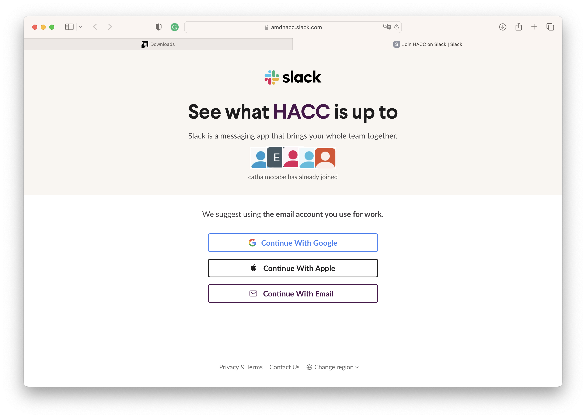

<article class="markdown-body entry-content p-3 p-md-6" itemprop="text">

<a href="https://github.com/fpgasystems/hacc#--heterogenous-accelerated-compute-cluster">Back to top</a>

# Technical support
As mentioned [here,](https://www.xilinx.com/member/xup_research_clusters.html) we do not provide technical support and you should not use any of ETH’s emails with that purpose. Instead, please write to [research_clusters@amd.com](mailto:research_clusters@amd.com) or join the [HACC Slack workspace](https://join.slack.com/t/xaccworkspace/shared_invite/zt-o2xkrmj6-51z5BlI5WCBjwgpFXbO6Kw) to interact with other researchers. 

*HACC Slack workspace.*