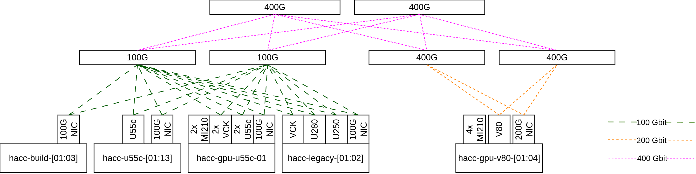

# Topology
Our HACC consists of 20+ servers subdivided in groups each with a specific setup. Some servers contain a single accelerator, others multiple, so users a free to explore the architecture they need, e.g. a specific FPGA, FPGA+GPU interaction or GPU only. All servers are also connected to our high-speed network with NICs (Network Interface Cards). The FPGAs are also directly connected to the high-speed network, allowing for a lot of interesting distributed system research.

*ETHZ-HACC infrastructure. This diagram is for illustrative purposes and may be subject to change. Please refer to the table below for the specific server configuration.*

## Servers
Our servers are split in two main groups: **build servers and experiment servers**. We further subdivide the experiment servers in groups that have the same composition of devices. The table below shows a quick overview of the subgroups of our servers and their devices.
<table class="tg" align="center">
  <thead>
    <tr class="tg-0pky" align="center">
      <th rowspan="2">Servers</th>
      <th colspan="3">Ultrascale+ FPGA</th>
      <th colspan="2">Versal FPGA</th>
      <th colspan="1">GPU</th>
      <th colspan="2">NIC</th>
    </tr>
    <tr class="tg-0pky" align="center">
      <th>U250</th>
      <th>U280</th>
      <th>U55C</th>
      <th>VCK5000</th>
      <th>V80</th>
      <th>MI210</th>
      <th>100G</th>
      <th>200G</th>
    </tr>
  </thead>
  <tbody>
    <tr class="tg-0pky" align="center">
      <td>hacc-build-[01:03]</td>
      <td></td>
      <td></td>
      <td></td>
      <td></td>
      <td></td>
      <td></td>
      <td>&#9679;</td>
      <td></td>
    </tr>
    <tr class="tg-0pky" align="center">
      <td>hacc-u55c-[01:13]</td>
      <td></td>
      <td></td>
      <td>&#9679;</td>
      <td></td>
      <td></td>
      <td></td>
      <td>&#9679;</td>
      <td></td>
    </tr>
    <tr class="tg-0pky" align="center">
      <td>hacc-gpu-v80-[01:04]           </td>
      <td>&nbsp;                         </td>
      <td>&nbsp;                         </td>
      <td>&nbsp;                         </td>
      <td>&nbsp;                         </td>
      <td>&#9679;                        </td>
      <td>&#9679; &#9679; &#9679; &#9679;1</td>
      <td>&nbsp;                         </td>
      <td>&#9679;</td>
    </tr>
    <tr class="tg-0pky" align="center">
      <td>hacc-gpu-u55c-01               </td>
      <td>&nbsp;                         </td>
      <td>&nbsp;                         </td>
      <td>&#9679; &#9679;                </td>
      <td>&#9679; &#9679;                </td>
      <td>&nbsp;                         </td>
      <td>&#9679; &#9679;2    </td>
      <td>&#9679;</td>
      <td></td>
    </tr>
    <tr class="tg-0pky" align="center">
      <td>hacc-legacy-[01:02]</td>
      <td>&#9679;</td>
      <td>&#9679;</td>
      <td></td>
      <td>&#9679;</td>
      <td></td>
      <td></td>
      <td>&#9679;</td>
      <td></td>
    </tr>
  </tbody>
  <tfoot>
    <tr>
      <td colspan="10">
        &#9679; Number of devices. 
        1 All 4 GPUs are connected using a 4P Infinity FabricTM Link Bridge  
        2 GPUs are connected in groups of 2 using a 2P Infinity FabricTM Link Bridge  
      </td>
    </tr>
  </tfoot>
</table>

### Build servers
Build servers are dedicated for development and bitstream synthesis. These build servers are open to access by multiple users simultaneously **without a booking.**

We maintain a broad collection of Vivado, Vitis and ROCm versions on our build servers. Users can select their preferred version using the `module` command. See the [module section](software-tools.md#module) for more info.

### Experiment servers
Experiment servers host one or more acceleration devices to allow you to run your experiments on real hardware. To ensure repeatable results of your experiments, we require users to reserve a timeslot for exclusive access for our experiment users using our [booking system](booking-system.md).

Our experiment servers contain only a single version of Vivado/Vitis, since Vivado should only be used to load bitstreams on these machines. Bitstreams built with one Vivado version have no issue being loaded by Vivado of a different version.

### Server Topology
Most of the servers within the same group consists out of the exact same server model, however not for all of them. To get detailed topology information about the server they run their experiment on, we encourage our users to use tools like `lstopo`, `lspci`, `lscpu`, `lshw`, `numactl`, etc to get this information. In the future we aim to have this information directly available in our booking system.

### USB - JTAG connectivity
All of our FPGAs have an USB-JTAG connection to their host server. This allows users (with the right permissions) to have a more fine-grained interaction with the FPGA, as compared to interacting through the XRT shell. This allows for development of bitstreams that don't make use of a shell (ie. XRT), which we refer to as the [Vivado workflow](terminology.md#vivado-workflow).

## Network Topology

Our servers connect to multiple networks, each with their intended purpose: management network, access network and data network.

*Management, access and data networks. This diagram is for illustrative purposes and may be subject to change.*

### Management network
The management network connects to the Board Management Controllers (BMCs) of the servers giving us remote lights-out control, including turning a server on/off without physical presence. This network is not accessible for HACC users.

### Access network
The access network is a 10Gbit network that only should be used to reach our servers using SSH. Please avoid this network for any experiment traffic.

### Data network
The data network is our **high-speed network intended for experiments**. It consists of a 2-tier Clos network (leaf-spine) underlay with a VXLAN overlay. We tend to connect our high-speed network interfaces to two separate leaf switches to allow for maximum path flexibility (for ECMP experiments). We also aim to support RoCEv2 with congestion signals like ECN. The switches in our experiment network are a mix of 100Gbit and 400Gbit switches.

The interfaces of the high-speed NICs have consistent names: `data1`, `data2`, etc. Currently all interfaces in the data network have an IP address in the same subnet. Tooling is being developed to allow moving an interface to a separate subnet. This will enable routed paths and ECMP experiments.

*Experiment network with leaf-spine architecture (Still work in progress)*
