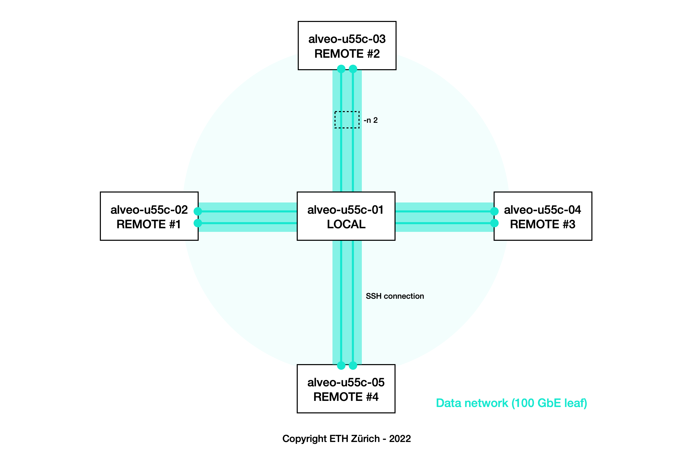

<div id="readme" class="Box-body readme blob js-code-block-container">
<article class="markdown-body entry-content p-3 p-md-6" itemprop="text">
<p align="right">
<a href="https://github.com/fpgasystems/hacc/blob/main/infrastructure-validation/README.md#infrastructure-validation">Back to infrastructure validation</a>
</p>

# Message passing interface validation with mpich
In this experiment, we are using CLI’s [sgutil validate mpi](../../CLI/docs/sgutil-validate-mpi.md#sgutil-validate-mpi) command to verify MPI message-passing standard on the ETHZ-HACC network.

### Prerrequisites
* You must have a valid authentication key pairs for SSH in your **~/.ssh** directory, and
* Your public key must be added to the authorized keys. 

```
$ ssh-keygen
$ cat ~/.ssh/id_rsa.pub >> ~/.ssh/authorized_keys
```

If the public key **~/.ssh/id_rsa.pub** is not present, *sgutil validate iperf* will run the commands above for you automatically.

## Experiment
1. Use the [booking system](https://alveo-booking.ethz.ch/login.php) to reserve the servers you wish to validate,
2. Login to the server you want to set as the iperf server—all others will be the clients for the experiment,
3. Run ```sgutil validate mpi``` and wait for the results.


*Message passing interface validation with mpich.*

## Results
In this experiment, we have reserved five servers (alveo-u55c-01 to alveo-u55c-05) where alveo-u55c-01 is the local instance connecting to the remotes. **Please, remember that** ```sgutil validate iperf``` **sets -n (the number of processes to use) to two.** This means that each remote server will execute two copies of the compiled MPI program—so the local server receives results from a total of eight processors:


*Results.*

## Background materials

### hosts file
```
alveo-u55c-02-mellanox-0:2
alveo-u55c-03-mellanox-0:2
alveo-u55c-04-mellanox-0:2
alveo-u55c-05-mellanox-0:2
```

### mpi_hello.c source code
```c
#include <mpi.h>
#include <stdio.h>

int main(int argc, char** argv) {
	MPI_Init(NULL, NULL);      // initialize MPI environment
	int world_size; // number of processes
	MPI_Comm_size(MPI_COMM_WORLD, &world_size);

	int world_rank; // the rank of the process
	MPI_Comm_rank(MPI_COMM_WORLD, &world_rank);

	char processor_name[MPI_MAX_PROCESSOR_NAME]; // gets the name of the processor
	int name_len;
	MPI_Get_processor_name(processor_name, &name_len);

	printf("Hello world from processor %s, rank %d out of %d processors\n", processor_name, world_rank, world_size);

	MPI_Finalize(); // finish MPI environment
}
```