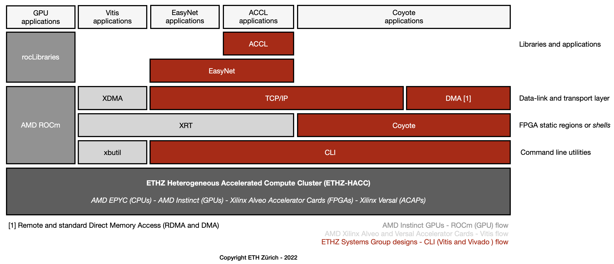

# Hardware acceleration platform

As a multi-core, GPU, and FPGA cluster, ETHZ-​HACC allows research in distributed systems, databases, cloud computing, and hardware acceleration of data science. Internally, we are using ETHZ-HACC to conduct extensive research to assemble an Infrastructure for heterogeneous architectures and hardware acceleration. All our advances  are open-source and offered as a design platform through the Systems Group RunTime. With this initiative, we hope that ETHZ-HACC users will be able to develop their accelerated applications more quickly.

*Hardware acceleration platform.*

<!-- The following applications are available through ETHZ-HACC [CLI](../CLI/README.md#cli) [UNDER DEVELOPMENT]:

* ACCL: Accelerated Collective Communication Library
* Coyote
* EasyNet: 100 GbE network for HLS -->
<!-- * Farview
* Hardware Transaction Processing for multi-channel memory node
* Modularis
* Road Runner: a high-performance TCP/IP network stack -->

<!-- ## ACCL: Accelerated Collective Communication Library
ACCL enables computing kernels resident in the FPGA fabric to communicate directly under host supervision without requiring data movement between the FPGA and host. Instead, ACCL uses Road Runner (a Vitis-compatible TCP and UDP stacks) to connect FPGAs directly over Ethernet at up to 100 GbE on Alveo cards. See on GitHub.

## Coyote
Coyote is an open source, portable, configurable *shell* for FPGAs which provides a full suite of OS abstractions, working with the host OS. Coyote supports secure spatial and temporal multiplexing of the FPGA between tenants, virtual memory, communication, a range of shared networking (RDMA or Road Runner’s high-performance TCP/IP stack), and memory management inside a uniform execution environment. The overhead of Coyote is small, and the performance benefit is significant, but more importantly, it allows us to reflect on whether importing OS abstractions wholesale to FPGAs is the best way forward. See on GitHub.

### Hardware Transaction Processing for multi-channel memory node
Transactional memory attempts to simplify concurrent programming by allowing a group of load and store instructions to execute in an atomic way. It is a concurrency control mechanism analogous to database transactions controlling access to shared memory in concurrent computing. Transactional memory systems provide high-level abstraction as an alternative to low-level thread synchronization. Building a hardware transaction processing layer for the multi-channel memory node is valuable. See on GitHub.

## EasyNet: 100 GbE network for HLS
EasyNet provides a set of MPI-like communication primitives for both point-to-point and collective operations (host-to-FPGA or FPGA-to-FPGA) as a High Level Synthesis (HLS) library. Such primitives are written to saturate the 100 GbE TCP/IP interface provided by Road Runner achieving very low latency. EasyNet allows developers to write hardware kernels with the network abstracted away behind standard interfaces. See on GitHub. -->

<!-- ## Farview
Cloud deployments disaggregate storage from compute, providing more flexibility to both the storage and compute layers. **Farview**—a disaggregated memory solution for databases—is an FPGA-based smart NIC design making DRAM available as a disaggregated, network attached memory module capable of performing data processing at line rate over data streams to/from disaggregated memory, operating as a remote buffer cache with operator offloading capabilities in heterogeneous clusters. This project builds on Coyote-RDMA implementations. -->

<!-- ## Modularis
The enormous quantity of data produced every day together with advances in data analytics has led to a proliferation of data management and analysis systems. Typically, these systems are built around highly specialized monolithic operators optimized for the underlying hardware. While effective in the short term, such an approach makes the operators cumbersome to port and adapt, which is increasingly required due to the speed at which algorithms and hardware evolve. **Modularis**—an execution layer for data analytics over based on sub-operators—takes benefit of heterogeneous distributed platforms to resembling traditional database operators but at a finer granularity. This project builds on Coyote-RDMA implementations.  -->

<!-- ## Road Runner: a high-performance TCP/IP network stack
Road Runner provides a 100 GbE TCP/IP and UDP interfaces based on Xilinx’s open-source and out-of-the-box Vitis components. The complementary logic building Road Runner ensures that such components are integrated on the FPGA without degrading its performance. As we can see in the diagram above, Road Runner is the communication layer for the EasyNet and ACCL—and integrates with Coyote too. -->
